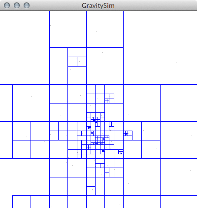
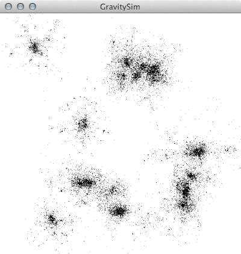

##About
GravitySim is a gravity simulator (duh) written in C, using the [Barnes-Hut](http://en.wikipedia.org/wiki/Barnes%E2%80%93Hut_simulation) algorithm to approximate gravity interactions between objects. The only dependency is the [GLFW2 library](https://github.com/glfw/glfw-legacy), you shoud be able to install it using either apt-get on linux or homebrew on OSX. 

#####Installing GLFW2 on OSX
```
brew tap homebrew/versions
brew install --build-bottle --static glfw2
```

##Usage
Compile with ```make mac``` for OSX or ```make linux``` for linux (only tested on ubuntu). Now you should be able to run it using ```./gravitysim```.  
To customize simulation you can call it with different arguments.
```
./gravitysim number_of_galaxies objects_per_galaxy galaxy_size
```  
For instance:  
```./gravitysim 10 1000 100``` creates 10 galaxies with 1000 objects per galaxy and diameter 100 pixels.  
```./gravitysim 10000 1 1``` creates 10000 galaxies with one object per galaxy and diameter 1 pixel.  
You could also customize a lot of options using build_config.h file (such as G constant, sd treshold, max speed or max mass), but it requires rebuilding whole project.
Have fun.

##Screenshots
  
  
  

##License
[The MIT License (MIT)](http://opensource.org/licenses/mit-license.php)